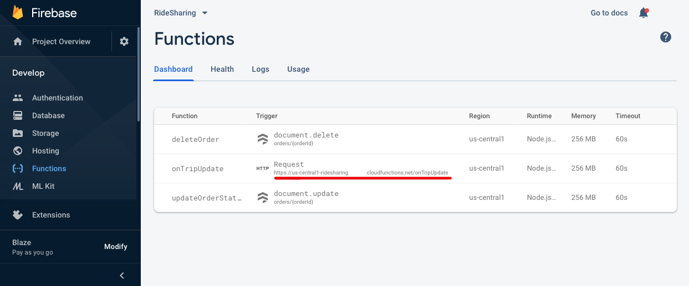
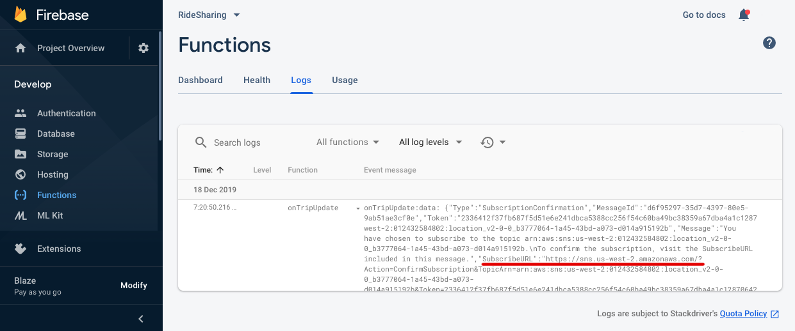

# Firebase Cloud Functions for HyperTrack Ridesharing sample app

This repository contains Firebase Cloud Functions that create and complete trips and manage orders for Ridesharing apps for [iOS](https://github.com/hypertrack/ridesharing-ios) and [Android](https://github.com/hypertrack/ridesharing-android).

* [Requirements](#requirements)
* [Add to your project](#add-to-your-project)
* [Documentation](#documentation)
* [FAQs](#frequently-asked-questions)
* [Contribute](#contribute)
* [Support](#support)

## Requirements

Firebase Cloud Functions require a paid account to make outbound API calls. This includes API calls to HyperTrack APIs. We recommend using the Blaze plan. It gives a lot of bandwidth for free, which is more then enough to internally test the app.

## Add to your project

1. Clone the repo.

```bash
git clone https://github.com/hypertrack/uber-for-x-firebase.git
cd uber-for-x-firebase
```

2. Install Firebase tools CLI

```bash
npm install -g firebase-tools
```

3. Login to your account and choose your project

```bash
firebase login
firebase use --add
```
Select the project from dropdown menu


4. Install function dependencies

```bash
cd functions ; npm install ; cd ..
```

5. Configure functions with HyperTrack API Keys

Copy `AccountId` and `SecretKey` from HyperTrack's dashboard [setup page](https://dashboard.hypertrack.com/setup). Paste them in `/functions/index.js` file into [placeholders on line 9](https://github.com/hypertrack/ridesharing-firebase/blob/875bf0a719153eecdd6eb5694e4a1c715142d242/functions/index.js#L9). Keep the `:` separator between them.

6. Deploy functions into your Firebase Ridesharing project

```bash
firebase deploy --only functions
```

7. Setup webhooks from HyperTrack to Cloud Functions

* Open the Functions > Dashboard tab in your Firebase project
* Copy the trigger URL for `onTripUpdate` function
  
* Go to HyperTrack's dashboard [setup page](https://dashboard.hypertrack.com/setup) and add this URL as a webhook URL.
* Go back to Firebase and open the Logs tab. Search for `onTripUpdate` function's log with `SubscriptionConfirmation` message. Open the `SubscribeURL` in browser. This will activate the webhook.
  

8. Your Cloud Functions backend is now ready to interface with HyperTrack APIs.

## Documentation

For detailed documentation of the APIs, customizations and what all you can build using HyperTrack, please visit the official [docs](https://docs.hypertrack.com/).

## Frequently Asked Questions

* [No project active](#no-project-active)
* [Error parsing triggers: Cannot find module 'moment'](#error-parsing-triggers-cannot-find-module-moment)

### No project active

```
No project active. Run with --project <projectId> or define an alias by
running firebase use --add
```

This error while deploying functions means that you need to select the project first. Run `firebase use --add` and select your project from dropdown menu, then add any alias to the project.

### Error parsing triggers: Cannot find module 'moment'

This error can happen when your didn't run `npm install` from the `functions` directory. Run `cd functions ; npm install ; cd ..` from the projects directory or execute the commands one by one:

```bash
cd functions
npm install
cd ..
```

## Contribute
Feel free to clone, use, and contribute back via [pull requests](https://help.github.com/articles/about-pull-requests/). We'd love to see your pull requests - send them in! Please use the [issues tracker](https://github.com/hypertrack/ridesharing-firebase/issues) to raise bug reports and feature requests.

We are excited to see what live location feature you build in your app using this project. Do ping us at help@hypertrack.com once you build one, and we would love to feature your app on our blog!

## Support
Join our [Slack community](https://join.slack.com/t/hypertracksupport/shared_invite/enQtNDA0MDYxMzY1MDMxLTdmNDQ1ZDA1MTQxOTU2NTgwZTNiMzUyZDk0OThlMmJkNmE0ZGI2NGY2ZGRhYjY0Yzc0NTJlZWY2ZmE5ZTA2NjI) for instant responses. You can also email us at help@hypertrack.com.
